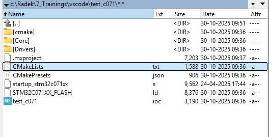
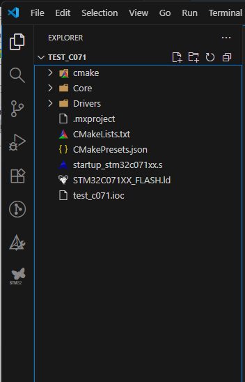

# Open project with VSCode

1. Create Cubemx project for any available device
2. Select projest generation for **CMAKE**
3. Generate project

To use correctly peroject with VScode you must open it That `CMakeLists.txt` is in root. 

# Open CMAKE project for STM32 wtih VSCode

Thre is STM32 extention which will detect this project and ask if you want to create the STM32Cube project from it. It is important without it you cannot bult the prioject. 

If you missed the popup it on botton right in Notification icon

If popup is not there you can do `CTRL+SHIFT+P` to open command pallete
And type `stm32cube: setup stm32cube project

This step will connect the cmake extention to the st tools 

Mainly tell which cmake version to use, where to find it. Where to find gcc, ...
Create a bundle-store that you will compile the prject which same version of compiler and cmake. 