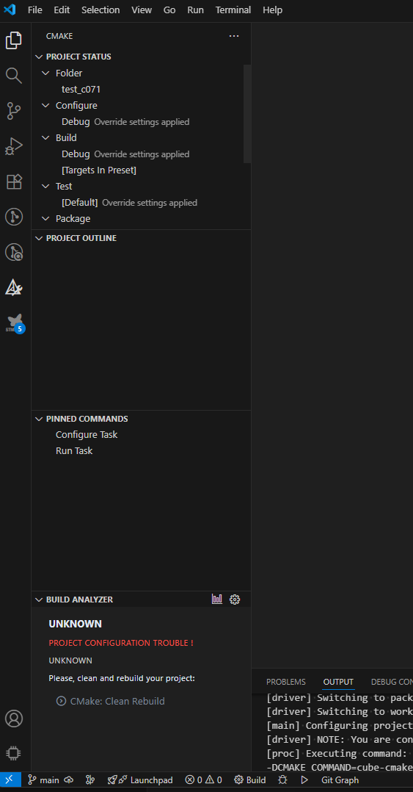
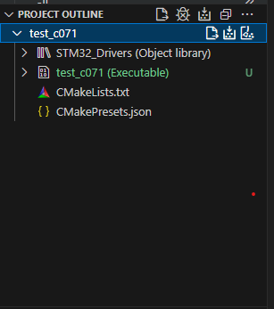
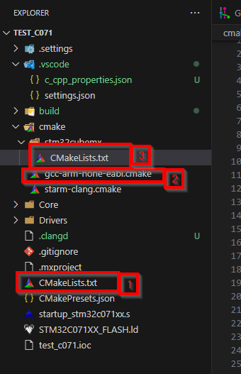

# Build

1. Open CMAKE extention tab

Configure project

<!-- When project was discovered by STM32Cube the Cmake addon will not catch change of this operation. So it will not show any project. 

You can open/close project. Or use CTRL+SHIFT+P and run `CMake: Reset CMake Tools Extention State` 

 -->

Build your project

# Cmake structure

1. Project description like name and where to find rest of build conifuration
2. Complier flags
3. Files to be compiled