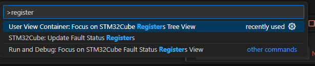

# Debug

1. Go to `Run and debug` Tab
2. Click on `Create a launch.json file` - your debug settings
3. select `STM32Cube:STLink GDB Server`
4. Save the json
5. run debug

# Debug panels

## Disasembly 

1. Right click to panel
2. Select `Open disasembly view`

## Memory view 

1. use `CTRL+SHIFT+P`
2. Search `Memory: Show Memory Inspector`

## Periphery registers

1. use `CTRL+SHIFT+P`
2. Search `STM32Cube Registers Tree View`

# [Launch file options](./4_launch_configurations.md)

