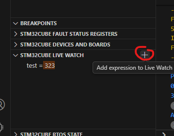

# Configure launch.json


## Live watch

For example under `runEntry` type `liveWatch`.
It will autofill the rest

```json
      "liveWatch": {
        "enabled": true,
        "samplesPerSecond": "4"
      },
```
your launch.json will looks like

```json
{
  // Use IntelliSense to learn about possible attributes.
  // Hover to view descriptions of existing attributes.
  // For more information, visit: https://go.microsoft.com/fwlink/?linkid=830387
  "version": "0.2.0",
  "configurations": [
    
    {
      "type": "stlinkgdbtarget",
      "request": "launch",
      "name": "STM32Cube: STM32 Launch ST-Link GDB Server",
      "origin": "snippet",
      "cwd": "${workspaceFolder}",
      "preBuild": "${command:st-stm32-ide-debug-launch.build}",
      "runEntry": "main",
      "liveWatch": {
        "enabled": true,
        "samplesPerSecond": "4"
      },
      "imagesAndSymbols": [
        {
          "imageFileName": "${command:st-stm32-ide-debug-launch.get-projects-binary-from-context1}"
        }
      ]
    }
  ]
}
```


In debug tab you will hade on bottol left STM32 Live Watch panel


Click on `+` and type variable youi want to watch



## Connect to device

Into launch.json
type `serverReset`

```json
      "serverReset": "Connect under reset",
```

other options

- None
- Core reset
- Hardware reset
- Software system reset
- Connect under reset


## RTOS support

add

```json
      "serverRtos": {
        "enabled": true,
        "port": "60000",
        "driver": ""
      },
```

## Connection protocol
```json
      "serverInterface": "SWD",
```

options 
- SWD
- JTAG

## STLink serial number

```json
      "serverSerialNumber": "066DFF3332504E3043221953",
```

## Shared STLink
```json
      "serverShared": false,
```


## External loader
list with external loaders
```json
"serverExtLoader": [],
```