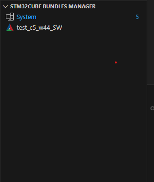
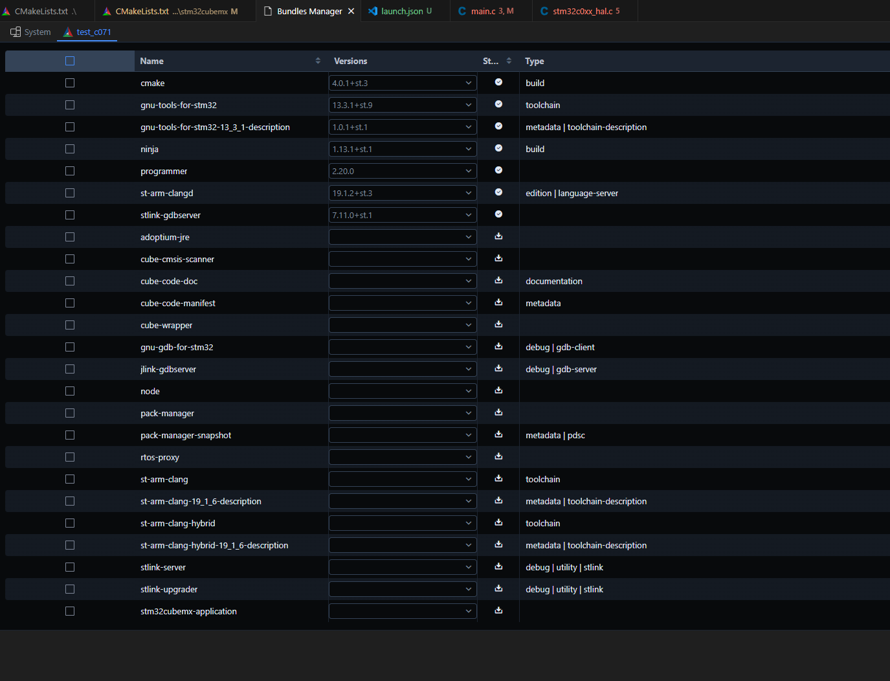

# Cube command

The ST extention added cube comamnd

## Pack manager

This allow to control pack version. Which are tools used on your PC like cube programmer. 
This can be also found in pack manager. 

You can sselect version of st tools. To be sure your project is compiled with specific tool version

