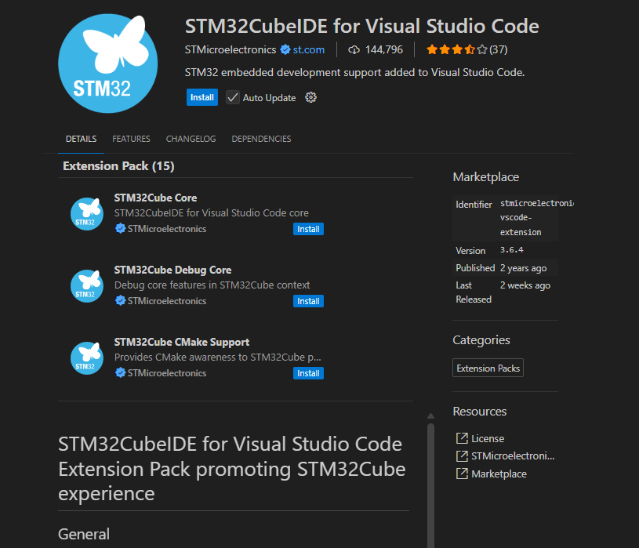

# VSCode

What is VSCode
``
Visual Studio Code is a source-code editor developed by Microsoft for Windows, Linux, macOS and web browsers. Features include support for debugging, syntax highlighting, intelligent code completion, snippets, code refactoring, and embedded version control with Git.
``

In short CodeEditor

# Profiles

VSCode allow to use profiles 
- it is like sandbox where you can have different configurations and extentions
- you can have one profile for code editing and second for debug STM32

Possible to run from cmdline
This command will open VScode on current position with `Default` profile
```
code --profile Default .
```

This will open Vscode with STM32_Debug_C5 debug profile.
```
code --profile STM32_Debug_C5 .
```

# Basic Left menu items

- Explorer
- Search in files
- Git
- Extentions


# Install STM32 Extention
1. Open Extentions
2. Search for `STM32CubeIDE for Visual Studio Code `
3. click to install



Now you have STM32 Extention pack and you can debug STM32 in VSCode
The pack is set of extentions for STM32 some from ST from third party


# Other chapters:

## [Setup/import project](./1_setup_cube_project.md)

## [Build_project](./2_build_project.md)

## [Debug](./3_debug.md)

## [Launch file options](./4_launch_configurations.md)

## [CMD line build](./5_ci_cd.md)

## [Other features](./6_other_features.md)