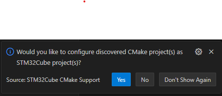
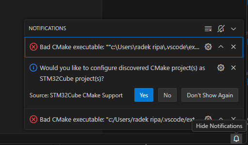
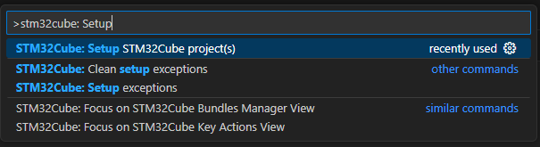

# VSCode

What is VSCode
``
Visual Studio Code is a source-code editor developed by Microsoft for Windows, Linux, macOS and web browsers. Features include support for debugging, syntax highlighting, intelligent code completion, snippets, code refactoring, and embedded version control with Git.
``

In short CodeEditor

# Profiles

VSCode allow to use profiles 
- it is like sandbox where you can have different configurations and extentions
- you can have one profile for code editing and second for debug STM32

Possible to run from cmdline
This command will open VScode on current position with `Default` profile
```
code --profile Default .
```

This will open Vscode with STM32_Debug_C5 debug profile.
```
code --profile STM32_Debug_C5 .
```

# Basic Left menu items

- Explorer
- Search in files
- Git
- Extentions


# Install STM32 Extention
1. Open Extentions
2. Search for `STM32CubeIDE for Visual Studio Code `
3. click to install


Now you have STM32 Extention pack and you can debug STM32 in VSCode
The pack is set of extentions for STM32 some from ST from third party


# Open project with VSCode

1. Create Cubemx project for any available device
2. Select projest generation for **CMAKE**
3. Generate project

To use correctly peroject with VScode you must open it That `CMakeLists.txt` is in root. 


# Open CMAKE project for STM32 wtih VSCode

Thre is STM32 extention which will detect this project and ask if you want to create the STM32Cube project from it. It is important without it you cannot bult the prioject. 


If you missed the popup it on botton right in Notification icon


If popup is not there you can do `CTRL+SHIFT+P` to open command pallete
And type `stm32cube: setup stm32cube project



This step will connect the cmake extention to the st tools 

Mainly tell which cmake version to use, where to find it. Where to find gcc, ...
Create a bundle-store that you will compile the prject which same version of compiler and cmake. 


# Build

1. Open CMAKE extention tab


Configure project


<!-- When project was discovered by STM32Cube the Cmake addon will not catch change of this operation. So it will not show any project. 

You can open/close project. Or use CTRL+SHIFT+P and run `CMake: Reset CMake Tools Extention State` 

 -->


Build your project


# Cmake structure


1. Project description like name and where to find rest of build conifuration
2. Complier flags
3. Files to be compiled


# Debug


1. Go to `Run and debug` Tab
2. Click on `Create a launch.json file` - your debug settings
3. select `STM32Cube:STLink GDB Server`
4. Save the json
5. run debug


# Debug panels

## Disasembly 

1. Right click to panel
2. Select `Open disasembly view`


## Memory view 

1. use `CTRL+SHIFT+P`
2. Search `Memory: Show Memory Inspector`


## Periphery registers

1. use `CTRL+SHIFT+P`
2. Search `User View Container: Focus on STM32Cube Registers Tree View`


## Live watch

### Configure launch.json

For example under `runEntry` type `liveWatch`.
It will autofill the rest

```json
      "liveWatch": {
        "enabled": true,
        "samplesPerSecond": "4"
      },
```
your launch.json will looks like

```json
{
  // Use IntelliSense to learn about possible attributes.
  // Hover to view descriptions of existing attributes.
  // For more information, visit: https://go.microsoft.com/fwlink/?linkid=830387
  "version": "0.2.0",
  "configurations": [
    
    {
      "type": "stlinkgdbtarget",
      "request": "launch",
      "name": "STM32Cube: STM32 Launch ST-Link GDB Server",
      "origin": "snippet",
      "cwd": "${workspaceFolder}",
      "preBuild": "${command:st-stm32-ide-debug-launch.build}",
      "runEntry": "main",
      "liveWatch": {
        "enabled": true,
        "samplesPerSecond": "4"
      },
      "imagesAndSymbols": [
        {
          "imageFileName": "${command:st-stm32-ide-debug-launch.get-projects-binary-from-context1}"
        }
      ]
    }
  ]
}
```

In debug tab you will hade on bottol left STM32 Live Watch panel


Click on `+` and type variable youi want to watch


## Connect to device

Into launch.json
type `serverReset`

```json
      "serverReset": "Connect under reset",
```

other options

- None
- Core reset
- Hardware reset
- Software system reset
- Connect under reset


# Cube command

The ST extention added cube comamnd


## Pack manager

This allow to control pack version. Which are tools used on your PC like cube programmer. 
This can be also found in pack manager. 


You can sselect version of st tools. To be sure your project is compiled with specific tool version


## Build over command line

```bash
git clone https://mycompany-repo.com/myproject.git
cube bundle install --project
cube cmake --preset Debug
cube cmake --build --preset Debug
```